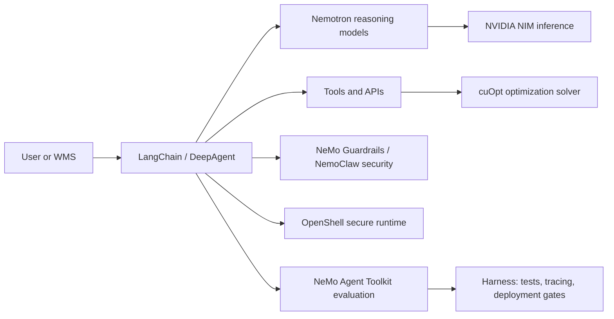

# NVIDIA Agentic AI Guide

This guide explains how NVIDIA's agentic AI technologies fit together and how they can evolve the warehouse slotting and inventory optimization platform.

## Big Picture

NVIDIA Agentic AI is an ecosystem rather than one product. It combines:

- Reasoning models such as **Nemotron**
- Inference services such as **NVIDIA NIM**
- Agent frameworks such as LangChain, LangGraph, and the **NeMo Agent Toolkit**
- Optimization libraries such as **cuOpt**
- Security controls such as **NeMo Guardrails**
- Secure execution infrastructure such as **OpenShell**
- Model lifecycle tools from **NeMo**



For this warehouse platform, the business goal could be:

> Reduce picker travel while preserving capacity, inventory availability, temperature, and hazardous-material constraints.

## NVIDIA Agentic AI

An agentic system differs from a conventional chatbot because it can:

1. Interpret a goal.
2. Plan multiple steps.
3. Retrieve information.
4. Call tools.
5. Validate results.
6. Take approved actions.
7. Explain what it did.

A production design should use language models for planning and explanation, while using deterministic code and optimization solvers for hard business rules.

## NVIDIA Nemotron

**Nemotron** is NVIDIA's family of open models for reasoning, tool use, coding, retrieval, multimodal understanding, and safety.

Nemotron can serve as the reasoning model for each specialized agent:

- **Demand agent:** Interpret demand trends and forecasts.
- **Inventory agent:** Assess stockout and overstock risk.
- **Warehouse agent:** Reason over layout and operating rules.
- **Orchestrator:** Plan, delegate, compare results, and explain decisions.

Nemotron models can be:

- Called through a hosted API.
- Served with NVIDIA NIM.
- Run locally with vLLM, SGLang, TensorRT-LLM, Ollama, or llama.cpp.
- Customized and evaluated with NeMo tooling.

Nemotron should not replace deterministic business logic. An LLM can explain why a SKU should move, but capacity, temperature, hazmat, and authorization checks should be enforced by code or a solver.

## LangChain DeepAgent and a Harness

A LangChain DeepAgent is an agent architecture for longer workflows involving:

- Planning
- Sub-agent delegation
- Tool calls
- State and memory
- Intermediate results
- Replanning after failures
- Final synthesis

A Nemotron-powered implementation uses Nemotron as the model behind the LangChain agent. The exact model and endpoint depend on whether the deployment uses NIM, NVIDIA-hosted inference, or self-hosting.

### What the Harness Provides

A **harness** is the controlled environment around the agent. It should provide:

- Fixed test scenarios
- Mock warehouse data
- Tool-call interception
- Constraint validation
- Expected-result comparisons
- Latency and cost measurement
- Trace capture
- Regression testing
- Approval gates before real-world actions

The warehouse harness should test cases such as:

- A fast-moving SKU is placed closer to picking.
- A temperature-controlled SKU is never placed in a standard zone.
- A hazmat SKU is never assigned to an incompatible bin.
- No two recommendations consume the same destination slot.
- A recommendation is rejected when capacity is insufficient.
- The same input produces reproducible solver results.

A harness is essential because an agent can produce a convincing explanation while still making an invalid operational recommendation.

## NVIDIA OpenShell

**OpenShell** provides a controlled runtime for autonomous agents. Its purpose is to limit what an agent can do while still allowing it to use tools and interact with approved systems.

Typical controls include:

- Sandboxed execution
- Permission boundaries
- Restricted filesystem access
- Network policies
- Secret isolation
- Tool authorization
- Action logging
- Human approval for sensitive operations

For a warehouse system, OpenShell could allow an agent to read inventory data, call a cuOpt service, generate a move plan, and write a draft recommendation. It should not automatically modify the WMS, cancel inbound shipments, change inventory quantities, delete records, or access arbitrary credentials.

A useful action flow is:

```text
Agent proposes action
    -> Guardrail validates policy
    -> OpenShell checks permission
    -> Harness validates business constraints
    -> Human or workflow approval
    -> WMS receives action
```

## NVIDIA cuOpt

**cuOpt** is a numerical optimization engine. It is not an LLM.

It can solve constrained decision problems such as:

- Assignment
- Scheduling
- Resource allocation
- Vehicle routing
- Facility and warehouse optimization

For warehouse slotting, cuOpt could optimize:

- SKU-to-bin assignment
- Picker travel distance
- Slot capacity
- SKU compatibility
- Temperature requirements
- Hazmat rules
- Replenishment effort
- Co-location preferences
- Labor constraints

The agent translates a business request into a structured optimization problem. cuOpt then calculates a mathematically valid solution.

```text
Nemotron:
"Prioritize fast-moving A-class SKUs."

cuOpt:
"Given the constraints, assign these SKUs to these bins with minimum cost."
```

The strongest architecture is hybrid:

- **LLM:** Planning, interpretation, explanation, and exception handling.
- **cuOpt:** Assignment and optimization.
- **Python rules:** Hard validation and safety checks.
- **Human:** Approval for high-impact changes.

The current `OptimizationAgent` uses a simple distance-based heuristic. cuOpt could replace that heuristic with a formal constrained optimization model.

## NVIDIA NeMo

**NeMo** is NVIDIA's broader AI lifecycle platform. It covers:

- Synthetic data generation
- Data curation
- Model customization
- Fine-tuning and alignment
- Retrieval
- Evaluation
- Guardrails
- Agent optimization

Important components include:

- **NeMo Data Designer:** Generate domain-specific synthetic data.
- **NeMo Curator:** Prepare and filter data.
- **NeMo Customizer:** Customize models for a domain.
- **NeMo Retriever:** Provide embeddings, extraction, and reranking.
- **NeMo Evaluator:** Evaluate models, RAG pipelines, and agents.
- **NeMo Guardrails:** Apply policy and safety controls.
- **NeMo Agent Toolkit:** Evaluate and optimize agent workflows.
- **NeMo Framework:** Support large-scale model training.

For the warehouse platform, NeMo can support a continuous improvement loop:

```text
Warehouse events
    -> Curate and anonymize data
    -> Evaluate agent decisions
    -> Customize the model
    -> Re-deploy
    -> Monitor KPI and error rates
```

## NVIDIA NeMo Guardrails

**NeMo Guardrails** adds programmable controls around LLM and agent behavior.

Guardrails can be applied to:

- User input
- Retrieved documents
- Model output
- Tool calls
- Tool results
- Conversation topics
- PII
- Jailbreak attempts
- Policy compliance

Useful warehouse rails include:

### Input Rails

Reject requests such as:

- Ignore all warehouse restrictions.
- Move every SKU to Zone 1.
- Change inventory without approval.

### Tool-Call Rails

Validate that:

- The destination zone exists.
- The destination slot is available.
- SKU compatibility is respected.
- Capacity is sufficient.
- The user is authorized.
- The move cost is below the approval threshold.

### Output Rails

Require every recommendation to contain:

- SKU
- Current location
- Proposed location
- Business justification
- Expected KPI impact
- Constraints checked
- Confidence
- Approval status

Guardrails complement, but do not replace, deterministic validation.

## NemoClaw

**NemoClaw** should be treated as a higher-level secure agent deployment experience or stack built around NVIDIA agent technologies, particularly for autonomous agents that need stronger security and operational controls.

The conceptual distinction is:

- **NeMo Guardrails:** Policy logic and runtime checks.
- **NemoClaw:** Broader secure agent deployment and management.
- **OpenShell:** Sandboxed execution and permission boundaries.

These product names and packaging layers may evolve, so current NVIDIA documentation should be checked before selecting a production distribution. Conceptually, NemoClaw is relevant when agents operate continuously and need controls over what they can access, which tools they can invoke, which actions require approval, and how activity is logged.

## NVIDIA NIM

**NVIDIA NIM** packages models as production-ready inference microservices.

Instead of embedding a model directly into the application, the application calls an HTTP endpoint:

```text
LangChain agent
    -> NIM endpoint
        -> Nemotron model
            -> Structured response or tool call
```

NIM provides:

- Containerized model serving
- OpenAI-compatible APIs in many cases
- GPU-optimized inference
- Production runtime support
- Deployment across cloud and data center environments
- Security and lifecycle support through NVIDIA AI Enterprise offerings

For this platform, NIM could expose:

- A Nemotron reasoning model
- A Nemotron embedding or reranking model
- A Nemotron safety model
- A document parsing model

The production workflow calls NIM for reasoning while retaining explicit service boundaries and policy checks for hard constraints.

## NVIDIA NeMo Agent Toolkit

The current NVIDIA name is **NeMo Agent Toolkit**. It is an open-source toolkit for developing, evaluating, profiling, and optimizing agentic systems across frameworks.

It helps answer questions such as:

- Which agent step is slow?
- Which tool calls are expensive?
- Where does the agent fail?
- Is a smaller model sufficient?
- Did a prompt change improve accuracy?
- Does the system meet latency and cost targets?
- Which workflow path produces the best business result?

It is complementary to LangChain:

- **LangChain:** Build the agent workflow.
- **NeMo Agent Toolkit:** Measure and optimize the workflow.

Warehouse evaluation metrics could include:

- Constraint violation rate
- Recommendation acceptance rate
- Travel-distance improvement
- Stockout-risk reduction
- Tool-call success rate
- Hallucination rate
- Average latency
- Cost per optimization run
- Human override rate
- KPI prediction accuracy

## Recommended Architecture for This Platform

```text
WMS / ERP / Forecasting Systems
             |
             v
     LangChain DeepAgent
             |
     Nemotron via NIM
             |
   +---------+----------+
   |                    |
   v                    v
NeMo Retriever       Specialist Agents
warehouse knowledge  demand/inventory/warehouse
                        |
                        v
                 cuOpt optimization
                        |
                        v
              NeMo Guardrails
              + OpenShell policy
                        |
                        v
              Harness validation
                        |
                        v
              Human approval / WMS
                        |
                        v
              NeMo Agent Toolkit
                evaluation and tracing
```

## Mapping to the Existing Project

| Current component | NVIDIA-oriented evolution |
|---|---|
| `DemandIntelligenceAgent` | LangChain agent using Nemotron |
| `InventoryIntelligenceAgent` | Nemotron plus inventory tools |
| `WarehouseIntelligenceAgent` | Nemotron plus layout and retrieval tools |
| `OptimizationAgent` | Agent coordinating cuOpt |
| Distance heuristic | cuOpt constrained optimization |
| JSON audit trail | Structured traces and audit events |
| Manual validation | NeMo Guardrails plus Python validators |
| `agents/deep_workflow.py` | deepagents orchestrator and solve loop |
| KPI calculator | Harness evaluation and production monitoring |
| Synthetic generator | NeMo Data Designer or the existing Python generator |

## Core Design Principle

Use each technology for the problem it is designed to solve:

- **Nemotron:** Reasoning, planning, tool use, and explanation.
- **cuOpt:** Mathematical optimization under constraints.
- **NeMo Guardrails:** Policy enforcement and agent safety.
- **OpenShell:** Secure execution and permissions.
- **NIM:** Production model serving.
- **NeMo:** Model and agent lifecycle management.
- **NeMo Agent Toolkit:** Evaluation, profiling, and optimization.
- **Harness:** Repeatable tests and deployment gates.

The repository contains a production integration scaffold. Actual NVIDIA, cuOpt, OpenShell, WMS, ERP, and forecast services must be deployed and configured through environment variables.

## Architecture Compliance Assessment

The current solution is a **production-oriented integration scaffold**. It defines the production service boundaries and fail-closed governance path, but external services and credentials are required for a live deployment.

| Architecture layer | Current status |
|---|---|
| WMS, ERP, and forecasting systems | **Adapter implemented.** Local synthetic mocks are available; production URLs are environment-configured. |
| LangChain DeepAgent | **Workflow implemented with LangGraph.** Install the production dependencies to run it. |
| Nemotron via NIM | **Client implemented.** The actual NIM URL, model, and credential are environment-configured. |
| NeMo Retriever | **Client implemented.** The actual Retriever service is environment-configured. |
| Specialist agents | **NIM-backed production path implemented.** Deterministic runners may be injected for tests. |
| cuOpt | **Client implemented.** The actual cuOpt service owns the formal optimization model. |
| NeMo Guardrails | **Validation boundary implemented.** A configured Guardrails service is required for production policy enforcement. |
| OpenShell and NemoClaw | **Permission boundary implemented.** OpenShell or NemoClaw runtime deployment remains environment-specific. |
| Harness validation | **Implemented.** Constraint and regression tests are included. |
| Human approval and WMS execution | **Implemented.** WMS write-back requires an approved record and policy authorization. |
| NeMo Agent Toolkit | **Evaluation boundary implemented.** Quality, latency, errors, and traces are captured; toolkit export is deployment-specific. |
| Audit trail | **Implemented locally.** Approval records and workflow traces are persisted for integration with enterprise observability. |

The implemented execution path is currently:

```text
WMS / ERP / Forecast adapters
    -> LangGraph DeepAgent
    -> Nemotron through NIM
    -> NeMo Retriever and specialist agents
    -> cuOpt service
    -> Guardrails and OpenShell policy
    -> Harness validation
    -> Approval workflow
    -> WMS write-back
    -> Evaluation traces
```

### Production Migration Stages

To complete a live deployment, configure and operate the platform in these stages:

1. Add WMS, ERP, and forecasting API adapters.
2. Configure and deploy the LangChain or LangGraph DeepAgent workflow.
3. Connect agents to Nemotron through NIM.
4. Add NeMo Retriever for warehouse policies and operational documents.
5. Replace the heuristic optimizer with a cuOpt model.
6. Add NeMo Guardrails and OpenShell permission checks.
7. Build a repeatable harness with constraint and regression tests.
8. Add a human approval workflow before WMS write-back.
9. Add NeMo Agent Toolkit evaluation and tracing.

The local WMS, ERP, and forecast mocks are for integration development only. NVIDIA NIM, NeMo Retriever, cuOpt, Guardrails, OpenShell, and NemoClaw are never mocked.

## Official References

- [NVIDIA Nemotron](https://developer.nvidia.com/nemotron)
- [NVIDIA NeMo](https://docs.nvidia.com/nemo/)
- [NVIDIA NIM](https://docs.nvidia.com/nim/)
- [NVIDIA cuOpt](https://docs.nvidia.com/cuopt/)
- [NeMo Guardrails](https://docs.nvidia.com/nemo/guardrails/)
- [NeMo Agent Toolkit](https://docs.nvidia.com/nemo/agent-toolkit/latest/index.html)
